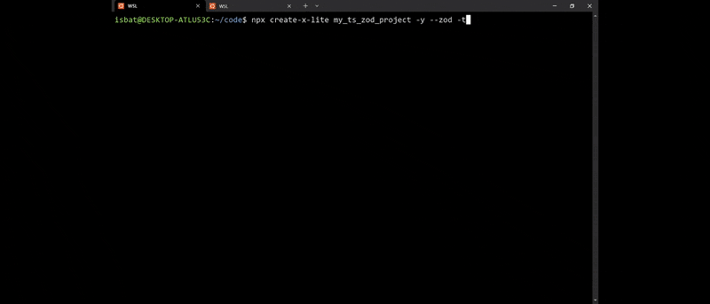

# create-x-lite

<p align="center">
  <a href="https://www.npmjs.com/package/create-x-lite">
    
  </a>
  <a href="https://github.com/IsbatBInHossain/create-x-lite/blob/main/LICENSE">
    
  </a>
</p>

<p align="center">
  <b>A modern, interactive CLI for scaffolding production-ready Express.js projects.</b>
  <br />
  Inspired by the developer experience of `create-vite`, `create-x-lite` removes the tedious boilerplate setup so you can start building your next great idea in seconds.
</p>

<p align="center">
  
</p>

---

_This project was created as a submission for the **[boot.dev](https://www.boot.dev/) Hackathon (July 2025)**._

## Table of Contents

- [Introduction: The "Why"](#introduction-the-why)
- [Quick Start](#quick-start)
- [A Dynamic Scaffolding Engine](#a-dynamic-scaffolding-engine)
- [Features](#features)
- [What You Get](#what-you-get)
- [Advanced Usage](#advanced-usage)
- [Philosophy](#philosophy)
- [Contributing](#contributing)
- [Roadmap](#roadmap)
- [License](#license)

## Introduction: The "Why"

The time between deciding to build an API and writing the first line of business logic is often filled with tedious, repetitive setup. While tools like `express-generator` exist, I always found myself immediately replacing their outdated configurations.

I built `create-x-lite` to solve this problem for myself and others. It's the tool I wish I had: a single command that generates a complete, modern, and flexible Express.js project, letting me focus on what truly matters: the code.

## Quick Start

Get started in seconds with a single command:

```bash
npx create-x-lite
```

The interactive guide will walk you through all configuration options. You can also specify a project name:

```bash
npx create-x-lite my-ts-project
```

**Examples:**

```bash
# Create with all defaults
create-x-lite my-app -y

# TypeScript project with Zod validation
create-x-lite my-api --typescript --zod

# Traditional structure with CommonJS
create-x-lite legacy-api --traditional --commonjs
```

## A Dynamic Scaffolding Engine

Unlike simple template cloners, `create-x-lite` operates as a dynamic scaffolding engine. After you select a base template (e.g., TypeScript with ESM), the tool programmatically modifies and enhances it with optional features.

For example, when you opt-in to Zod validation, the tool will:

1.  **Add Dependencies:** Inject `zod` into the `package.json`.
2.  **Copy Snippets:** Add pre-built middleware and schema files from an internal library.
3.  **Generate Code:** Use Handlebars templates to generate new, feature-specific files like a validated user route.
4.  **Modify Existing Code:** Read the main `index.ts` file and inject the necessary `import` and `app.use()` statements to integrate the new feature.

This architecture allows the tool to be incredibly flexible and scalable.

## Features

- **Interactive & Intuitive:** A step-by-step guided process to configure your project.
- **Non-Interactive Mode:** Use CLI flags for automated, scripted project setup.
- **TypeScript and JavaScript:** First-class support for both languages.
- **Modern and Legacy Modules:** Choose between modern **ESM** or legacy **CommonJS**.
- **Flexible Folder Structures:** Select a **feature-based** or **traditional MVC-style** structure.
- **Optional Schema Validation:** Add **Zod** for powerful, type-safe validation during setup.
- **Out-of-the-Box Tooling:** Every project comes pre-configured with ESLint, Prettier, and Nodemon.

## What You Get

A `create-x-lite` project is more than just a folder of files; it's a production-ready foundation. Here's an example of a generated TypeScript, ESM, Feature-based project with Zod:

```
my_ts_project/
├── eslint.config.js
├── nodemon.json
├── package.json
├── tsconfig.json
└── src
    └── core
    │   └── middlewares
    │       └── zod.middleware.ts
    └── features
    │   ├── healthcheck
    │   │   └── healthcheck.routes.ts
    │   └── user
    │       ├── user.routes.ts
    │       └── user.schema.ts
    └── index.ts
```

### Strictly Typed from the Start

For TypeScript projects, the generated `tsconfig.json` is configured with a strict ruleset (`"strict": true`, `noUnusedLocals`, etc.) to encourage robust, type-safe code from day one.

### Modern Linting and Formatting

Projects come with the latest ESLint "flat config" (`eslint.config.js`) and a pre-configured Prettier setup to ensure code quality and consistency across your entire codebase.

## Advanced Usage

### Global Installation (Optional)

For frequent use, you can install `create-x-lite` globally:

```bash
npm install -g create-x-lite
# Then use it anywhere
create-x-lite my-project
```

### Command line Flags

Skip the interactive prompts using command-line flags:

| Flag            | Alias | Description                          | Default (if -y) |
| --------------- | ----- | ------------------------------------ | --------------- |
| `--yes`         | `-y`  | Skip all prompts and use defaults    | N/A             |
| `--typescript`  | `-t`  | Use TypeScript instead of JavaScript | JavaScript      |
| `--commonjs`    | `-c`  | Use CommonJS instead of ESM          | ESM             |
| `--traditional` | `-T`  | Use traditional structure            | Feature-based   |
| `--zod`         |       | Add Zod for validation               | Disabled        |

## Philosophy

`create-x-lite` is built on a simple philosophy: empower developers with modern tools, but get out of their way.

Inspired by the fantastic developer experience of tools like `create-vite`, this project aims to provide an opinionated yet flexible foundation. While `express-generator` provides a starting point, `create-x-lite` provides a launchpad, configured with the tools and standards that professional developers expect in a modern backend project.

## Contributing

This project was born in a weekend hackathon, but I have a long-term vision for it. Contributions are absolutely welcome as it grows. This is a community tool, and I'm excited to see where we can take it together.
The best ways to get involved are to:

- Open an issue with bug reports or feature suggestions.
- Submit a pull request for bug fixes or new features.
- Share the project with other developers who might find it useful.

## Roadmap

My goal is for create-x-lite to become a comprehensive toolkit for backend development. The immediate roadmap includes:

- A powerful plugin system for databases (Prisma, TypeORM), authentication, and more.
- Support for other frameworks like Koa and Fastify.
- Automatic resource generators (npx x-lite g resource user).

## License

Released under the MIT License.
